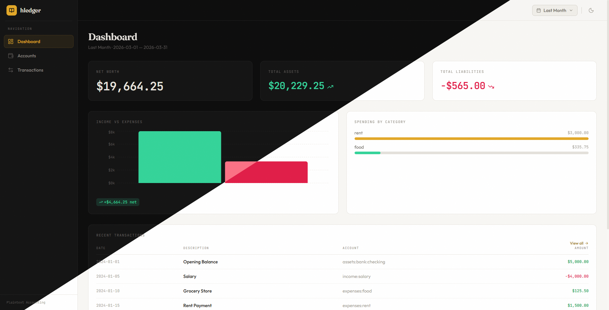

# hledger-web



A modern and visually appealing web interface for hledger built with React and Tailwind CSS. It provides a comprehensive dashboard and detailed views for managing personal finances via the hledger API.

## Project Overview

hledger-web connects directly to a local [hledger API](https://github.com/wolfsblu/hledger-api) instance to visualize financial data. The application features an interactive dashboard with net worth trends and spending categories, a hierarchical account tree with collapsible sections, and a full transaction register with advanced filtering. Every view respects a global date range filter that includes common presets and custom date selection. The interface supports both dark and light modes, automatically detecting system preferences while allowing for manual overrides.

## Technical Architecture

The frontend is built on React 19 and Vite for a fast development experience and optimized production builds. Styling is handled by Tailwind CSS 4, providing a clean and minimal aesthetic. Server state management and caching are powered by TanStack Query, while all API interactions are fully type-safe through a client generated from the OpenAPI specification using openapi-fetch. Charts are rendered with Recharts, and date manipulations utilize date-fns. Testing is conducted with Vitest and React Testing Library.

## Quick Start

Before starting the development server, ensure hledger is installed and the API server is running on port 8080 (e.g., [`hledger-api`](https://github.com/wolfsblu/hledger-api) `--server --port 8080`).

1. Install the project dependencies by running `npm install`.
2. Generate the TypeScript types from your local API instance with `curl -s http://127.0.0.1:8080/openapi.json -o openapi.json` and `npx openapi-typescript openapi.json -o src/api/v1.d.ts`.
3. Launch the application using `npm run dev`. The dashboard will be available at `http://localhost:5173`.

## Available Commands

| Command | Action |
| --- | --- |
| npm run dev | Starts the local development server |
| npm run build | Compiles the application for production |
| npm run preview | Previews the production build locally |
| npm run lint | Runs code quality checks with ESLint |
| npm test | Executes the test suite with Vitest |

## Directory Structure

```text
src/
├── api/          # Generated types and TanStack Query hooks
├── components/   # Shared UI (Sidebar, TopBar, Charts, StatCard)
├── context/      # DateRangeContext for global filtering
├── lib/          # Formatting utilities and date presets
├── pages/        # View components for Dashboard, Accounts, etc.
└── App.tsx       # Main router and layout shell
```

## License

This project is private and intended for personal use.
